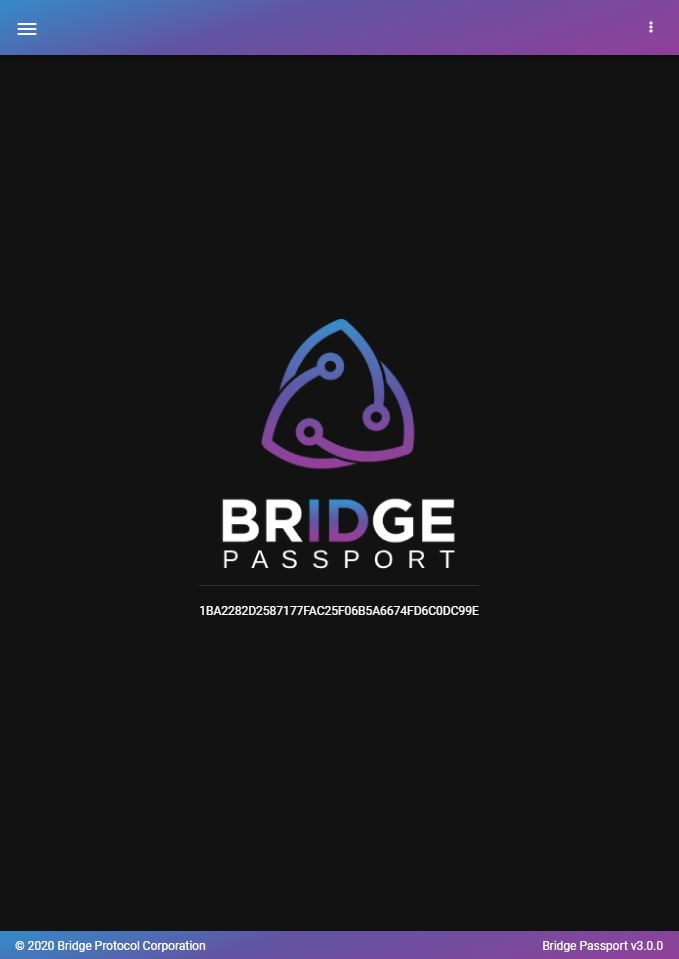

  

<h3 align="center">Bridge Passport Browser Extension</h3>

# Summary
The Bridge Passport Browser Extension enables end users to easily manage their digital identity using the Bridge Protocol.

# User Guide and Feature Documentation
Visit <a href="https://bridge-protocol.github.io/docs/extension-passport</a> to get started.

# Local Installation
- "npm i && npm run build"

# Browser Installation
### Chrome and Chromium Based Browsers (Opera, Brave, Edge, etc)
- Go to tools menu -> More Tools -> Extensions
- Enable Developer Mode (toggle switch upper right)
- Load Unpacked Extension
- Select /dist folder
  
### Firefox
- Tools menu -> Add-ons
- Select the gear icon -> Debug addons
- Load Temporary Add-on
- Select /dist manifest.json

# Additional Notes for Developers
Due to Google Chrome Web Store publishing policies, any site that interacts with the Bridge Passport Extension needs to be explicitly listed in the manifest under content_scripts -> matches.  While testing, you will need to add your local or published site URL to the list for the page to be able to interact with the extension for requesting auth and claims, requesting payments, etc.

`
"content_scripts": [
    {
      "matches": [
        "https://bridgeprotocol.azurewebsites.net/*",
        "http://localhost/*"
      ]
...
`
